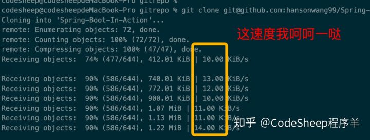
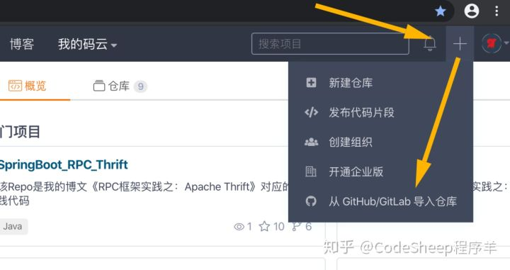
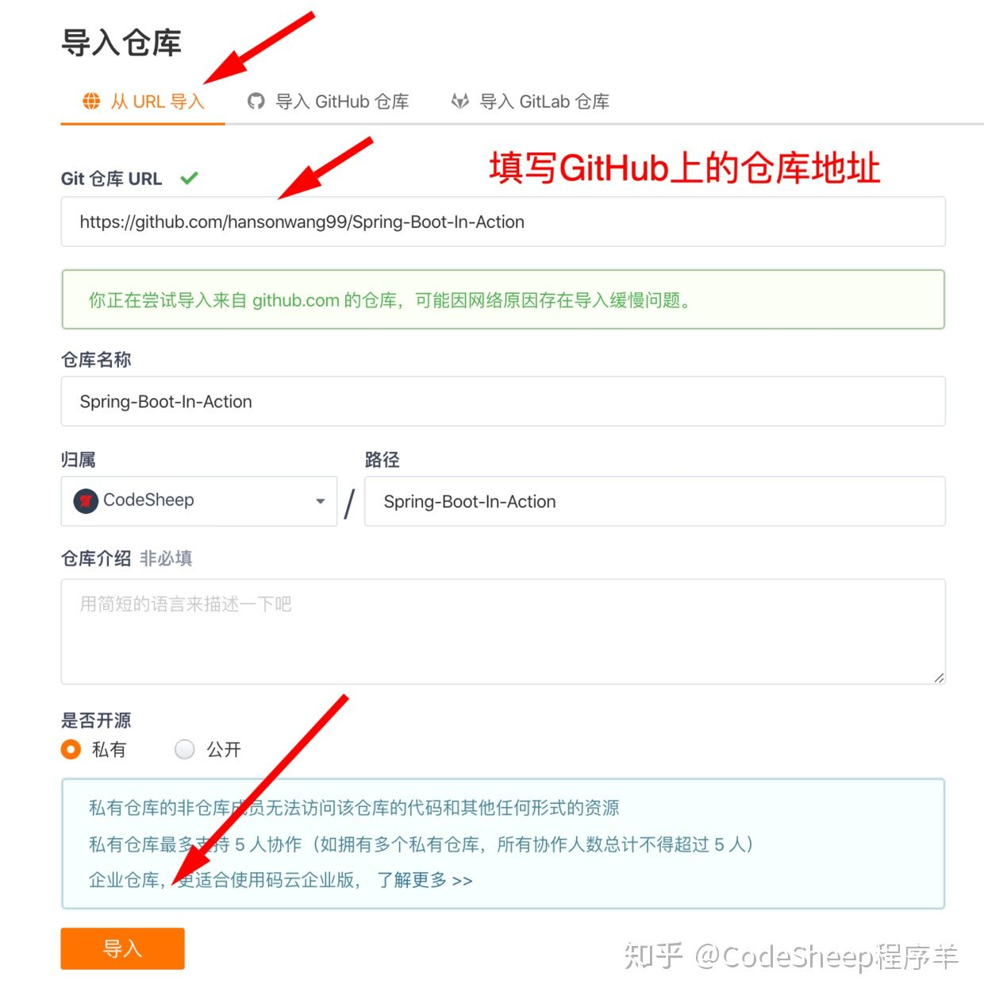
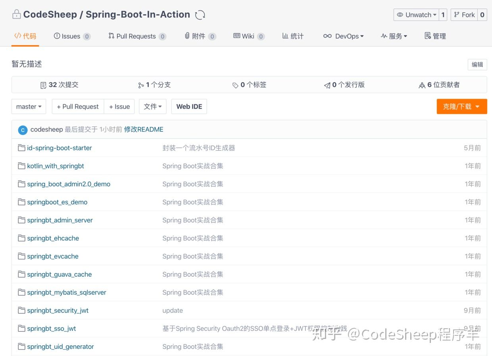
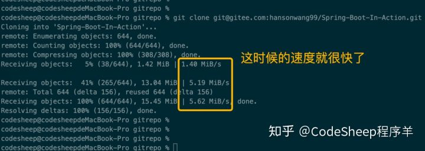
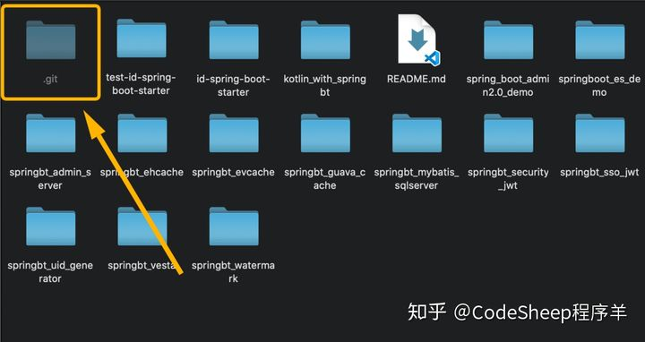
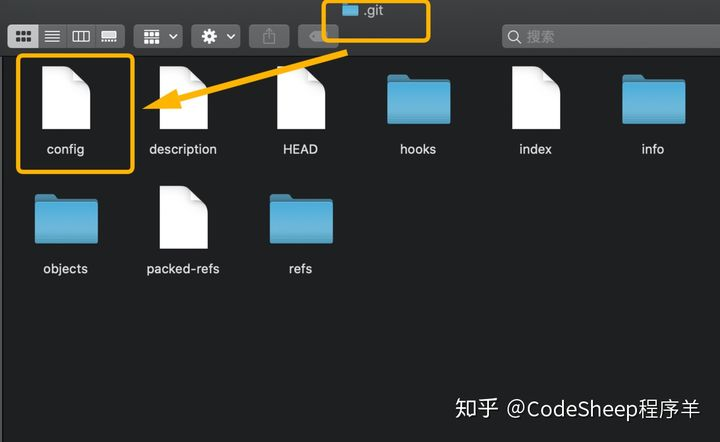
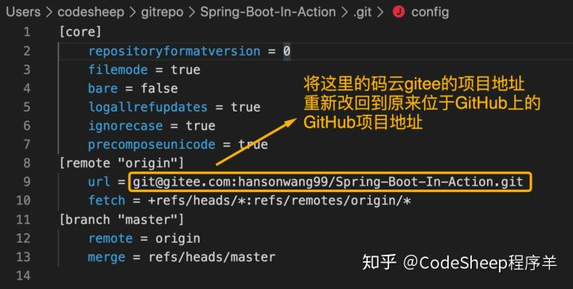

# 一招搞定GitHub下载加速！

------

## 一个痛点

众所周知，GitHub是一个巨大的开源宝库，以及程序员和编程爱好者的聚集地，包括我之前推荐的诸多优秀的开源项目全部都是位于GitHub上。

但是每当我们看到优秀的开源项目，准备去**下（bai）载（piao）**时，会发现`git clone`的速度异常之慢！就我个人而言，在我家里200M移动宽带的环境下，我克隆开源项目就没发现速度大于过`20.00 KiB/s`的时候，这简直太难受了。

小项目倒还好，我等几分钟无所谓；一旦项目庞大起来，或者项目文件数目一多，`git clone` 大概率会失败！

当然网上常见的诸如修改hosts、代理等方式实际使用效果并不一定好，而且也不稳定。

------

## “码云”是个好东西

接下来就介绍一种GitHub下载的加速方法：通过国内**码云平台**的转接，来完成GitHub上项目的下载加速。

> 感谢公众号小伙伴ioc提供思路

**（1）首先确保码云上有账户，可以正常使用，没有的可以自行注册一下。**

**（2）点击右上角新建仓库的加号`+`，选择“从`GitHub/GitLab`导入仓库”菜单**

**（3）然后填写位于`GitHub`上你想`clone`的仓库地址并导入**

这一步**交给码云来做**速度是非常快的，一会儿功夫，码云就克隆出了一份和GitHub上一模一样的项目！

**（4）接下来我们通过码云上的项目地址，将项目`clone`到本地，这时候的clone速度就很快了，几`MB/s`的速度是没问题的，很快项目就下载下来了。**

按道理讲这时候我们的目的已经达到了，不过不要忘了，还有一件事没做。

------

## 重新关联远端地址

要知道，这时候克隆到本地的项目关联的是码云Gitee的地址，已经和原来的GitHub项目**完全脱离了**，是另外一个**副本**。

在必要情况下（比如我们就是要给GitHub上的某个项目提`PR`），我们还需要重新将我们本地的项目关联到原来的GitHub项目上去，做法如下：

**（1）首先找到位于本地仓库目录下的隐藏文件夹`.git`**

**（2）用文本编辑器打开`.git`文件夹中的`config`配置文件**

将配置文件中的`[remote "origin"].url`字段重新关联到原来位于GitHub上的GitHub项目地址

> 当然你也可以通过命令行来修改远端地址，效果一样的

至此大功告成，本地项目就相当于是`clone`自GitHub，后续提代码，提`PR`到GitHub上都没有问题。

------

